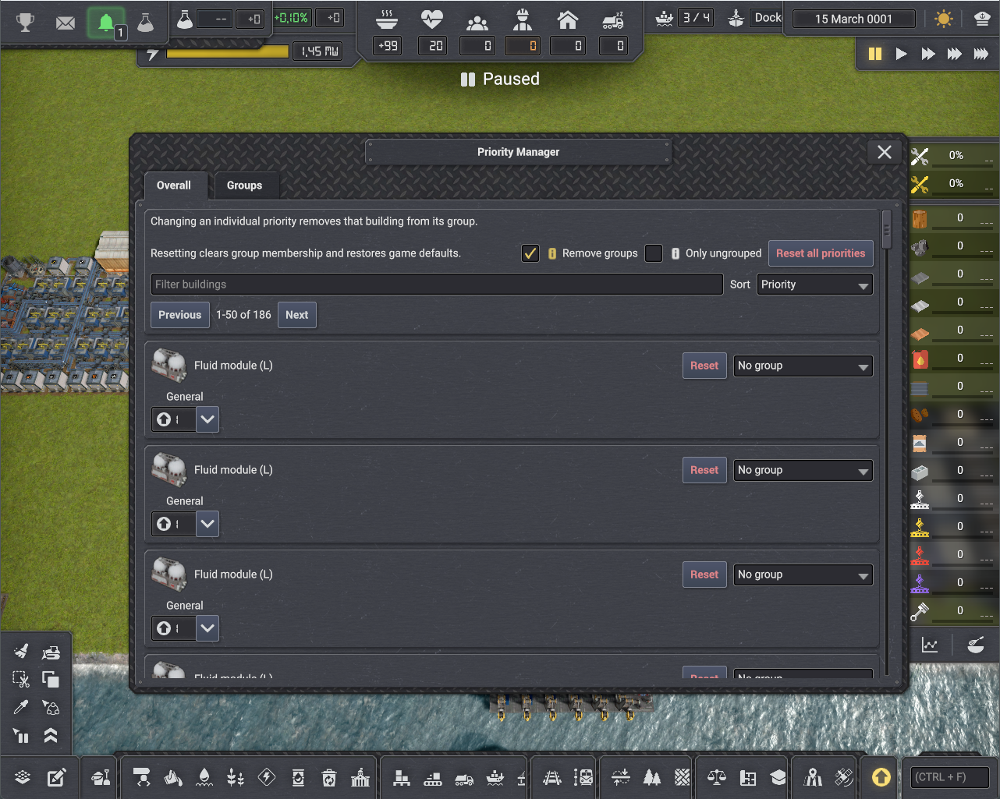
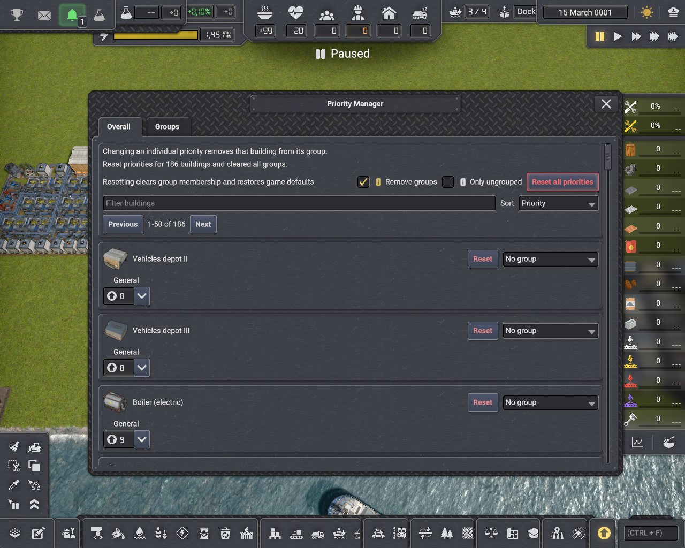

# Priority Manager

> **Maintainer note:** This entire project was vibe-coded with AI assistance. The UI/UX can be improved, but the maintainer will not be pursuing that work. Pull requests are welcome.

Priority Manager is an unofficial, non-commercial mod for Captain of Industry 0.8.7. It provides one place to inspect, change, reset, and organize building priorities.

## Features

- **Overall** lists every supported building, including storage and Cargo Depot priority controls. Filter by name, type, or group; sort by name, priority, group, or type; then select a building icon to pan the camera to it.
- **Groups** creates named groups with shared general, import, export, and generator priority settings. Settings apply only to members that support the relevant control.
- **Add buildings** uses the game-native single-click and area-selection controls to assign group members. Press Escape to cancel.
- **Building inspectors** include a collapsible **Priority group** section for direct group assignment and priority reset.
- **Reset actions** restore native defaults. Removing a building from a group or deleting a group resets its supported priority controls.
- **Reset all priorities** can preserve groups and/or limit the reset to buildings outside groups.

Priority values run from 1 (highest) to 15 (lowest). Generator group priority is available only when the generator exposes a native default value, so it can be restored safely.

## Showcase

### Screenshots

<a href="media/overview.png"></a>
<a href="media/reset_priorities.png"></a>

### Videos

- [Create a priority group](media/create_group.mp4)
- [Change a building's group](media/change_group.mp4)
- [Set group priorities](media/group_priorities.mp4)

## Installation

1. Download a release archive.
2. Extract the contained `PriorityManager` folder to `%APPDATA%\Captain of Industry\Mods`.
3. Enable Priority Manager when loading a save.

The mod can be added to and removed from existing saves. Restart Captain of Industry fully after replacing an installed DLL; returning to the main menu does not reliably reload mod code.

## Build From Source

Requirements:

- A lawful local installation of Captain of Industry 0.8.7.
- A .NET SDK that can build `net48` projects.

Build and deploy to the local mods folder:

```powershell
.\scripts\build.ps1 -Deploy
```

Pass a different game installation when necessary:

```powershell
.\scripts\build.ps1 -CoiRoot "D:\Steam\steamapps\common\Captain of Industry" -Deploy
```

Create a release archive:

```powershell
.\scripts\package.ps1
```

The archive is written to `dist\PriorityManager_0.7.1.zip`.

## License And Attribution

This project is licensed under [COI-Open](LICENSE), the Captain of Industry Open License. It may be used, modified, and shared only for Captain of Industry and in compliance with the [Captain of Industry Modding Policy](https://www.captain-of-industry.com/Legal/Modding-Policy).

This Mod includes short excerpts or references to Captain of Industry Game Code. Any such Game Code is (c) MaFi Games and is used only under the Captain of Industry Modding Policy.

Captain of Industry and MaFi Games are trademarks or registered trademarks of their respective owners. Priority Manager is unofficial and is not affiliated with or endorsed by MaFi Games.
